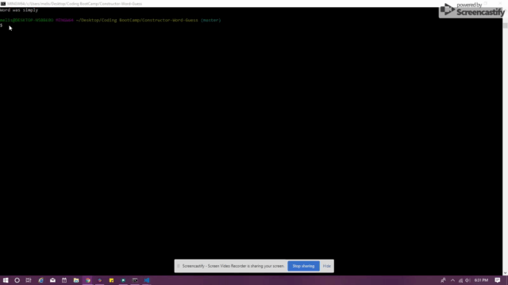

# Constructor-Word-Guess

## Advanced JavaScript Assignment

This homework assignment is optional.

In this unit's assignment, you will create a Word Guess command-line game using constructor functions. Here is an example of the results:

### The Instructions

#### The completed game should meet the following criteria

- [X] The completed game should be able to receive user input using the inquirer or prompt npm packages.

- [X] Your solution should have, at minimum, three files:

### _1. Letter.js_

**Contains a constructor, Letter**.

- [X] This constructor should be able to either display an underlying character or a blank placeholder (such as an underscore), depending on whether or not the user has guessed the letter.

  - *That means the constructor should define*

- [X] A string value to store the underlying character for the letter

- [X] A boolean value that stores whether that letter has been guessed yet

- [X] A function that returns the underlying character if the letter has been guessed, or a placeholder (like an underscore) if the letter has not been guessed

- [X] A function that takes a character as an argument and checks it against the underlying character, updating the stored boolean value to true if it was guessed correctly

### _2. Word.js_

- [X] Contains a constructor, 'Word' that depends on the 'Letter' constructor.

  - This is used to create an object representing the current word the user is attempting to guess.

  - *That means the constructor should define*

- [X] An array of new Letter objects representing the letters of the underlying word

- [X] A function that returns a string representing the word.

  - *This should call the function on each letter object (the first function defined in Letter.js) that displays the character or an underscore and concatenate those together.*

- [X] A function that takes a character as an argument and calls the guess function on each letter object (the second function defined in Letter.js)

### _3. Index.js_

- [X] The file containing the logic for the course of the game, which depends on Word.js

- [X] Randomly selects a word and uses the Word constructor to store it

- [X] Prompts the user for each guess and keeps track of the user's remaining guesses

#### _Hint_

** Letter.js should not require any other files **

** Word.js should only require Letter.js **

** Write Letter.js first and test it on its own before moving on, then do the same thing with Word.js **
